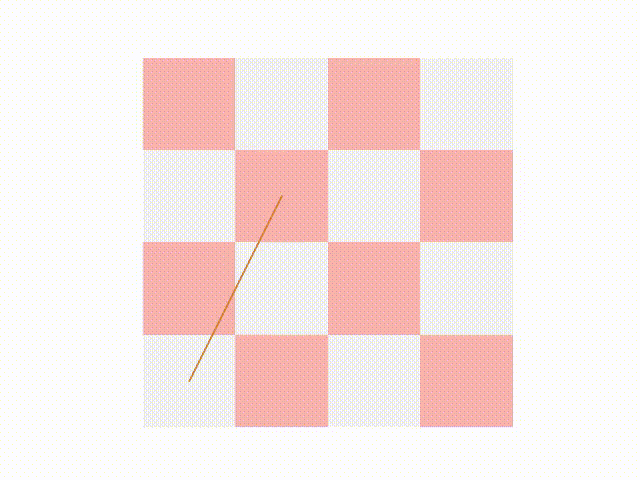
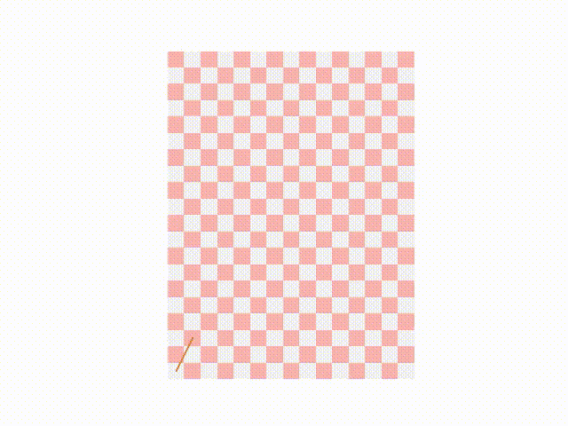

# Тестовое задание на замощение шахматной доски произвольного размера с повторениями
Необходимо замостить поле клеток размером `M*N`, где `M` и `N` могут принимать любые значения на отрезке `[4,100]`. Замостить надо с помощью фигуры конь, разрешены повторы т.е. конь может несколько раз наступать на одно и тоже поле. Количество шагов должно быть меньше чем `M*N*5`. Пример замощения показан на рисунке ниже


### Ключевые моменты по решению задачи
- замостить поле клеток `M*N`
- использовать фигуру конь (конь ходит буквой `"Г"`)
- наступать фигуре несколько раз на одну клетку можно
- нельзя выходить за границы поля `M*N`

## Посмотреть пример решения задачи для 5 х 5
 
Смотри визуализацию полного решения 5 х 5 выше, код для этого решения в файле `solution_example.py`
 
## Запуск решения
Требования:
- docker
 
Проверка демонстрационного решения для задачи 5 х 5 в файле `solution_example.py`:
```bash
make test_example
```
 
Проверка решения для произвольного размера доски в файле `solution.py`:
```bash
make test
```
 
## Критерии оценки работы
- `make test` - проходит успешно
- чем меньше повторных ходов доски тем лучше - score ближе к единице (см. как рассчитывается score для решения в функции `evaluate_task` из файла `test_solution.py`)
- код стайл
- читаемость кода


## Решение

### Алгоритм

[Opened Knight's tour](https://en.wikipedia.org/wiki/Knight%27s_tour)  -- путь коня без вступаний на одну и ту же клетку более одного раза. Такой путь существует для всех досок, указанных в описании задачи, кроме доски размером 4 на 4 -- для неё существует только путь с повторениями.

- вход: $m, n\in[4,100]$ -- стороны шахматной доски
- выход: $(x_1,y_1),\ldots,(x_T,y_T)$ --- список последовательных ходов коня

```
1. если m=4 и n=4:
    
2.      случайное блуждание с бектрекингом

3. иначе пока не найдено решение:
    
4.      для всех клеток доски (i,j):
    
5.          применить эвристику Варнсдорфа из клетки (i,j)

6. вернуть результат шагов 2 или 5.
```

Замечание: для доски 4 на 4 длина выхода $T>16$, для остальных досок $T=mn$.

Эвристика Варнсдорфа заключается в подборе следующего хода коня во время случайного блуждания: всегда переходить на клетку, с которой у коня наименьшее количество непосещённых клеток (т.е. ход в вершину графа минимальной степени). Это правило не гарантирует нахождение решения, поэтому нужны шаги 3 и 4.

Более тщательное тестирование, нежели функция `evaluate_task`, а также построение визуализации для призвольной доски  представлены в ноутбуке `testbed.ipynb`.

### Демонстрация

Доска 4 на 4:



Доска 15 на 20:

